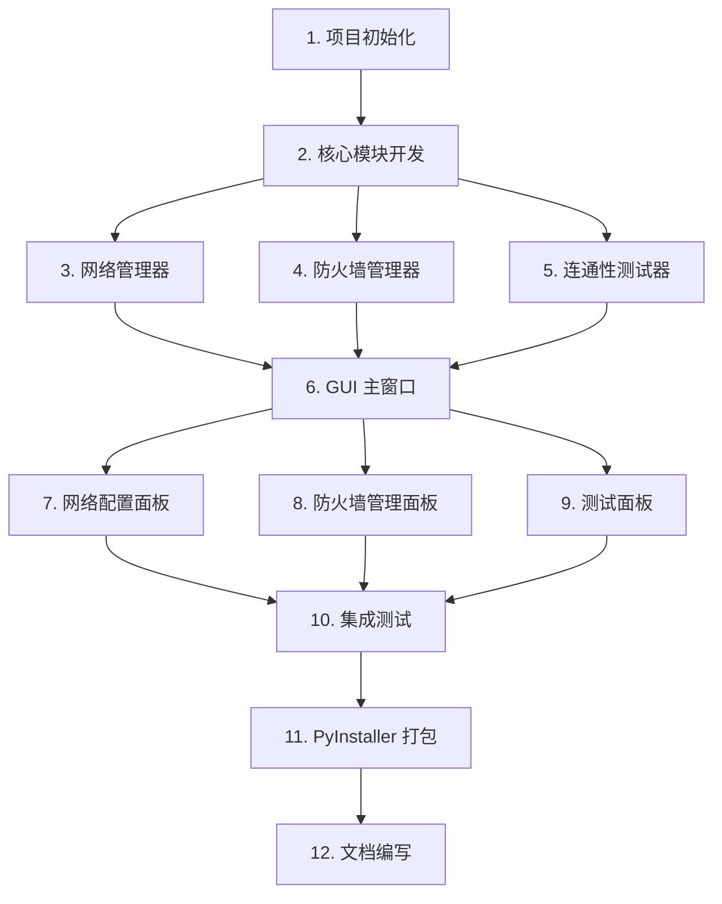

# Subnet Link Weaver v1.0.0 规划任务文档

## 1. 任务概览

### 1.1 项目信息
- **项目名称**: Subnet Link Weaver
- **版本**: v1.0.0
- **预估总工时**: 40 小时
- **任务总数**: 12 个

### 1.2 任务依赖图

> 📖 **图解说明**
>
> **本图表示**：任务之间的依赖关系。
>
> **节点含义**：
> - `A[1. 项目初始化]`: 创建项目结构、依赖、配置
> - `B[2. 核心模块开发]`: 创建基础类和接口
> - `C[3. 网络管理器]`: 实现网络配置功能
> - `D[4. 防火墙管理器]`: 实现防火墙管理功能
> - `E[5. 连通性测试器]`: 实现 ping 测试功能
> - `F[6. GUI 主窗口]`: 创建主窗口框架
> - `G[7. 网络配置面板]`: 实现网络配置界面
> - `H[8. 防火墙管理面板]`: 实现防火墙管理界面
> - `I[9. 测试面板]`: 实现连通性测试界面
> - `J[10. 集成测试]`: 进行完整功能测试
> - `K[11. PyInstaller 打包]`: 打包为可执行文件
> - `L[12. 文档编写]`: 编写用户文档和 API 文档
>
> **关系含义**：
> - `A → B`: 项目初始化完成后才能开发核心模块
> - `B → C/D/E`: 核心模块开发完成后才能实现具体功能
> - `C/D/E → F`: 功能模块完成后才能创建 GUI
> - `F → G/H/I`: 主窗口完成后才能创建子面板
> - `G/H/I → J`: 所有面板完成后才能进行集成测试
> - `J → K`: 测试通过后才能打包
> - `K → L`: 打包完成后才能编写文档
>
> **实施规则**：
> 1. 按照依赖关系顺序执行任务
> 2. 无依赖的任务可以并行执行（如 C、D、E）
> 3. 每个任务完成后需要进行代码审查
>
> **边界情况**：
> - 任务阻塞 → 分析原因，调整依赖关系
> - 任务失败 → 修复后重新执行
> - 资源不足 → 调整任务优先级

## 2. 详细任务列表

### Phase 1: 项目初始化 (P0, 4h)

#### 任务 1.1: 创建项目结构
- **描述**: 创建项目目录结构、配置文件、依赖文件
- **输入**: 无
- **输出**: 项目骨架
- **估时**: 2h
- **依赖**: 无

**子任务**:
- [ ] 创建目录结构
- [ ] 创建 `requirements.txt`
- [ ] 创建 `pyproject.toml`
- [ ] 创建 `.gitignore`
- [ ] 创建 `README.md`

#### 任务 1.2: 配置开发环境
- **描述**: 配置 Python 环境、安装依赖、设置代码规范
- **输入**: 项目结构
- **输出**: 可运行的开发环境
- **估时**: 2h
- **依赖**: 1.1

**子任务**:
- [ ] 使用 uv 安装依赖
- [ ] 配置 flake8/black/isort
- [ ] 配置 pre-commit hooks
- [ ] 创建基础测试框架

---

### Phase 2: 核心模块开发 (P0, 8h)

#### 任务 2.1: 创建数据模型
- **描述**: 定义网络适配器、ping 结果等数据模型
- **输入**: 无
- **输出**: 数据模型定义
- **估时**: 2h
- **依赖**: 1.2

**子任务**:
- [ ] 定义 `NetworkAdapter` dataclass
- [ ] 定义 `PingResult` dataclass
- [ ] 定义异常类层次结构
- [ ] 编写数据模型测试

#### 任务 2.2: 实现命令执行器
- **描述**: 封装系统命令执行逻辑，处理异常和超时
- **输入**: 无
- **输出**: 命令执行器类
- **估时**: 2h
- **依赖**: 1.2

**子任务**:
- [ ] 实现 `CommandExecutor` 类
- [ ] 添加超时处理
- [ ] 添加输出解析
- [ ] 编写执行器测试

#### 任务 2.3: 实现网络管理器
- **描述**: 实现网络适配器检测、静态 IP 配置、多 IP 挂载
- **输入**: 数据模型、命令执行器
- **输出**: 网络管理器类
- **估时**: 4h
- **依赖**: 2.1, 2.2

**子任务**:
- [ ] 实现 `get_adapters()` 方法
- [ ] 实现 `set_static_ip()` 方法
- [ ] 实现 `add_secondary_ip()` 方法
- [ ] 实现 `remove_secondary_ip()` 方法
- [ ] 编写网络管理器测试

---

### Phase 3: 功能模块开发 (P0, 8h)

#### 任务 3.1: 实现防火墙管理器
- **描述**: 实现防火墙状态检测、启用/禁用功能
- **输入**: 命令执行器
- **输出**: 防火墙管理器类
- **估时**: 3h
- **依赖**: 2.2

**子任务**:
- [ ] 实现 `get_status()` 方法
- [ ] 实现 `enable()` 方法
- [ ] 实现 `disable()` 方法
- [ ] 编写防火墙管理器测试

#### 任务 3.2: 实现连通性测试器
- **描述**: 实现 ping 命令封装和结果解析
- **输入**: 命令执行器
- **输出**: 连通性测试器类
- **估时**: 2h
- **依赖**: 2.2

**子任务**:
- [ ] 实现 `ping()` 方法
- [ ] 实现结果解析
- [ ] 编写测试器测试

#### 任务 3.3: 实现配置管理器
- **描述**: 实现配置文件的读写和验证
- **输入**: 无
- **输出**: 配置管理器类
- **估时**: 3h
- **依赖**: 2.1

**子任务**:
- [ ] 实现配置文件读取
- [ ] 实现配置文件写入
- [ ] 实现配置验证
- [ ] 编写配置管理器测试

---

### Phase 4: GUI 开发 (P0, 12h)

#### 任务 4.1: 创建主窗口框架
- **描述**: 创建主窗口、菜单栏、状态栏
- **输入**: 无
- **输出**: 主窗口类
- **估时**: 3h
- **依赖**: 2.3, 3.1, 3.2

**子任务**:
- [ ] 实现 `MainWindow` 类
- [ ] 创建菜单栏
- [ ] 创建状态栏
- [ ] 配置窗口样式

#### 任务 4.2: 实现网络配置面板
- **描述**: 实现网络适配器列表、快速配置界面
- **输入**: 网络管理器
- **输出**: 网络配置面板类
- **估时**: 4h
- **依赖**: 4.1

**子任务**:
- [ ] 实现适配器列表表格
- [ ] 实现快速配置表单
- [ ] 实现操作按钮
- [ ] 连接信号槽

#### 任务 4.3: 实现防火墙管理面板
- **描述**: 实现防火墙状态显示、开关按钮
- **输入**: 防火墙管理器
- **输出**: 防火墙管理面板类
- **估时**: 2h
- **依赖**: 4.1

**子任务**:
- [ ] 实现防火墙状态显示
- [ ] 实现开关按钮
- [ ] 连接信号槽

#### 任务 4.4: 实现测试面板
- **描述**: 实现目标 IP 输入、ping 测试按钮、结果显示
- **输入**: 连通性测试器
- **输出**: 测试面板类
- **估时**: 3h
- **依赖**: 4.1

**子任务**:
- [ ] 实现目标 IP 输入框
- [ ] 实现测试按钮
- [ ] 实现结果显示区域
- [ ] 连接信号槽

---

### Phase 5: 测试与优化 (P1, 4h)

#### 任务 5.1: 集成测试
- **描述**: 进行完整功能测试，修复问题
- **输入**: 所有模块
- **输出**: 测试报告
- **估时**: 3h
- **依赖**: 4.2, 4.3, 4.4

**子任务**:
- [ ] 编写集成测试用例
- [ ] 执行集成测试
- [ ] 修复发现的问题
- [ ] 编写测试报告

#### 任务 5.2: 性能优化
- **描述**: 优化 GUI 响应速度，减少操作延迟
- **输入**: 测试报告
- **输出**: 优化后的代码
- **估时**: 1h
- **依赖**: 5.1

**子任务**:
- [ ] 分析性能瓶颈
- [ ] 优化 GUI 布局
- [ ] 优化命令执行

---

### Phase 6: 打包与发布 (P1, 4h)

#### 任务 6.1: 创建应用图标
- **描述**: 设计和创建应用图标（SVG 和 ICO 格式）
- **输入**: 无
- **输出**: 图标文件
- **估时**: 1h
- **依赖**: 无

**子任务**:
- [ ] 设计 SVG 图标
- [ ] 转换为 ICO 格式
- [ ] 添加到项目中

#### 任务 6.2: PyInstaller 打包
- **描述**: 配置 PyInstaller，打包为可执行文件
- **输入**: 所有代码
- **输出**: 可执行文件
- **估时**: 2h
- **依赖**: 5.1

**子任务**:
- [ ] 创建 PyInstaller 配置
- [ ] 打包为单文件可执行文件
- [ ] 测试打包后的程序
- [ ] 优化打包体积

#### 任务 6.3: 文档编写
- **描述**: 编写用户文档和 API 文档
- **输入**: 所有代码
- **输出**: 文档文件
- **估时**: 1h
- **依赖**: 6.2

**子任务**:
- [ ] 编写用户使用手册
- [ ] 编写 API 文档
- [ ] 编写开发者指南

---

## 3. 任务依赖矩阵

| 任务 | 依赖 | 可并行任务 |
|------|------|-----------|
| 1.1 | 无 | - |
| 1.2 | 1.1 | - |
| 2.1 | 1.2 | 2.2 |
| 2.2 | 1.2 | 2.1 |
| 2.3 | 2.1, 2.2 | - |
| 3.1 | 2.2 | 3.2, 3.3 |
| 3.2 | 2.2 | 3.1, 3.3 |
| 3.3 | 2.1 | 3.1, 3.2 |
| 4.1 | 2.3, 3.1, 3.2 | - |
| 4.2 | 4.1 | 4.3, 4.4 |
| 4.3 | 4.1 | 4.2, 4.4 |
| 4.4 | 4.1 | 4.2, 4.3 |
| 5.1 | 4.2, 4.3, 4.4 | - |
| 5.2 | 5.1 | - |
| 6.1 | 无 | 其他任务 |
| 6.2 | 5.1 | - |
| 6.3 | 6.2 | - |

## 4. 并行执行计划

### 4.1 第一批并行任务 (时间: 0-2h)
- 任务 1.1: 创建项目结构

### 4.2 第二批并行任务 (时间: 2-4h)
- 任务 1.2: 配置开发环境

### 4.3 第三批并行任务 (时间: 4-8h)
- 任务 2.1: 创建数据模型
- 任务 2.2: 实现命令执行器

### 4.4 第四批并行任务 (时间: 8-12h)
- 任务 2.3: 实现网络管理器
- 任务 3.1: 实现防火墙管理器
- 任务 3.2: 实现连通性测试器
- 任务 3.3: 实现配置管理器

### 4.5 第五批并行任务 (时间: 12-24h)
- 任务 4.1: 创建主窗口框架
- 任务 4.2: 实现网络配置面板
- 任务 4.3: 实现防火墙管理面板
- 任务 4.4: 实现测试面板

### 4.6 第六批并行任务 (时间: 24-28h)
- 任务 5.1: 集成测试
- 任务 5.2: 性能优化

### 4.7 第七批并行任务 (时间: 28-32h)
- 任务 6.1: 创建应用图标
- 任务 6.2: PyInstaller 打包
- 任务 6.3: 文档编写

## 5. 里程碑

| 里程碑 | 时间 | 交付物 | 验收标准 |
|--------|------|--------|---------|
| M1: 项目初始化 | 2h | 项目结构、开发环境 | 可运行的 Python 环境 |
| M2: 核心模块完成 | 12h | 网络管理器、防火墙管理器、测试器 | 单元测试通过 |
| M3: GUI 完成 | 24h | 主窗口、各功能面板 | GUI 可正常显示和操作 |
| M4: 测试完成 | 28h | 集成测试报告 | 所有测试用例通过 |
| M5: 打包完成 | 32h | 可执行文件、文档 | 程序可正常运行 |

## 6. 风险评估

| 风险 | 影响 | 概率 | 应对措施 |
|------|------|------|---------|
| 系统命令兼容性 | 高 | 中 | 测试不同 Windows 版本，添加兼容层 |
| 管理员权限问题 | 高 | 低 | 启动时检测权限，提示用户重新运行 |
| GUI 性能问题 | 中 | 低 | 使用子线程执行耗时操作，优化布局 |
| 打包体积过大 | 低 | 中 | 使用 UPX 压缩，排除不必要的模块 |
