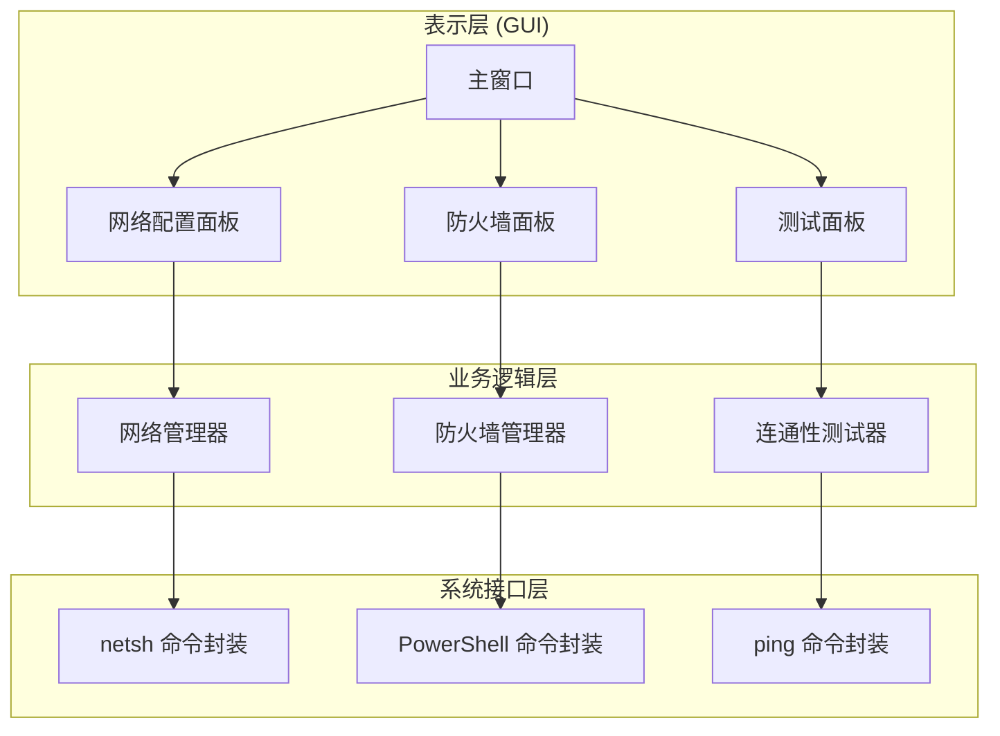
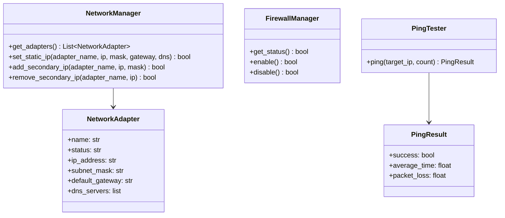
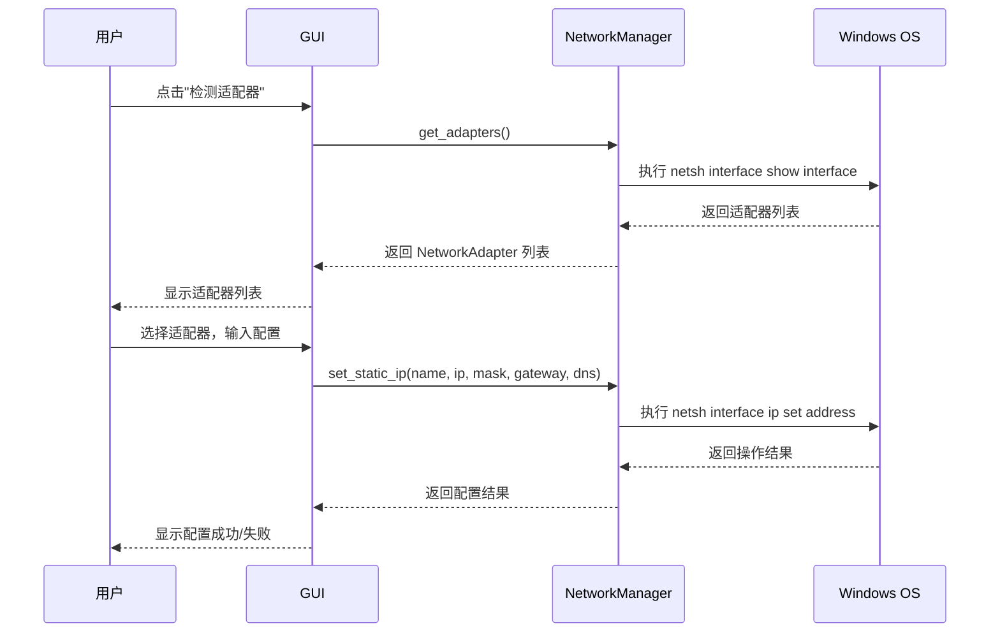
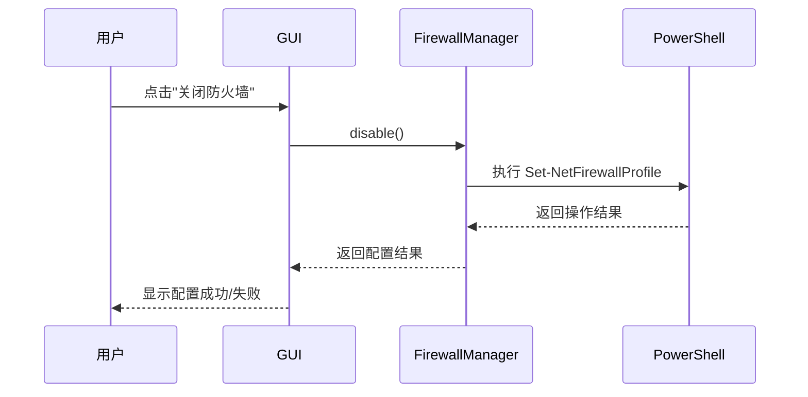

# Subnet Link Weaver v1.0.0 设计文档

## 1. 架构设计

### 1.1 系统架构



> 📖 **图解说明**
>
> **本图表示**：系统采用三层架构，将 GUI、业务逻辑和系统接口分离。
>
> **节点含义**：
> - `表示层`: PyQt6 GUI 组件，负责用户交互
> - `业务逻辑层`: 核心业务处理，封装网络配置逻辑
> - `系统接口层`: 调用 Windows 系统命令（netsh、PowerShell、ping）
>
> **关系含义**：
> - `A → B/C/D`: 主窗口包含多个功能面板
> - `B/C/D → E/F/G`: 面板调用对应的管理器
> - `E/F/G → H/I/J`: 管理器调用系统命令
>
> **实施规则**：
> 1. GUI 层只负责显示和用户输入，不处理业务逻辑
> 2. 业务逻辑层处理所有配置操作，返回结果给 GUI
> 3. 系统接口层封装所有系统命令调用，处理异常和返回值
>
> **边界情况**：
> - 系统命令执行失败 → 返回错误信息给业务层 → GUI 显示错误提示
> - 管理员权限不足 → 检测权限并提示用户重新运行
> - 网络适配器不存在 → 返回空列表，GUI 显示提示

### 1.2 模块设计



> 📖 **图解说明**
>
> **本图表示**：核心类的定义和关系。
>
> **节点含义**：
> - `NetworkAdapter`: 网络适配器数据模型
> - `NetworkManager`: 网络配置管理器
> - `FirewallManager`: 防火墙管理器
> - `PingTester`: 连通性测试器
> - `PingResult`: ping 测试结果
>
> **关系含义**：
> - `NetworkManager --> NetworkAdapter`: 管理器操作适配器对象
> - `PingTester --> PingResult`: 测试器返回结果对象
>
> **实施规则**：
> 1. 每个管理器类负责单一职责
> 2. 数据模型使用 dataclass 简化定义
> 3. 所有方法返回明确的结果类型
>
> **边界情况**：
> - 适配器不存在 → 抛出 NetworkAdapterNotFoundError
> - 命令执行超时 → 返回超时错误
> - 权限不足 → 抛出 PermissionError

## 2. 数据流设计

### 2.1 网络配置流程



> 📖 **图解说明**
>
> **本图表示**：网络配置的完整交互流程。
>
> **节点含义**：
> - `U`: 用户
> - `G`: GUI 界面
> - `NM`: NetworkManager 网络管理器
> - `OS`: Windows 操作系统
>
> **关系含义**：
> - `U->>G`: 用户在 GUI 上操作
> - `G->>NM`: GUI 调用业务逻辑
> - `NM->>OS`: 业务逻辑调用系统命令
> - `-->>`: 返回结果
>
> **实施规则**：
> 1. GUI 操作在主线程
> 2. 网络操作在子线程执行，避免阻塞 GUI
> 3. 使用信号槽机制传递结果
>
> **边界情况**：
> - 系统命令执行失败 → 捕获异常，返回错误信息
> - 操作超时 → 设置超时时间，返回超时错误
> - 用户取消操作 → 中断执行，恢复状态

### 2.2 防火墙配置流程



> 📖 **图解说明**
>
> **本图表示**：防火墙配置的交互流程。
>
> **节点含义**：
> - `U`: 用户
> - `G`: GUI 界面
> - `FM`: FirewallManager 防火墙管理器
> - `PS`: PowerShell 命令
>
> **关系含义**：
> - `U->>G`: 用户在 GUI 上操作
> - `G->>FM`: GUI 调用业务逻辑
> - `FM->>PS`: 业务逻辑调用 PowerShell 命令
> - `-->>`: 返回结果
>
> **实施规则**：
> 1. 防火墙操作需要管理员权限
> 2. 操作前需要用户确认
> 3. 操作后需要提醒用户恢复防火墙
>
> **边界情况**：
> - 权限不足 → 提示用户以管理员身份运行
> - 操作失败 → 返回错误信息，提示用户手动配置

## 3. 模块设计

### 3.1 目录结构

```
subnet_link_weaver/
├── src/
│   ├── main.py              # 入口点
│   ├── app.py               # 主应用程序
│   ├── gui/                 # GUI 组件
│   │   ├── __init__.py
│   │   ├── main_window.py   # 主窗口
│   │   ├── network_panel.py # 网络配置面板
│   │   ├── firewall_panel.py # 防火墙管理面板
│   │   ├── test_panel.py    # 连通性测试面板
│   │   └── status_bar.py    # 状态栏
│   ├── core/                # 核心逻辑
│   │   ├── __init__.py
│   │   ├── network.py       # 网络检测与配置
│   │   ├── firewall.py      # 防火墙管理
│   │   └── ping.py          # 连通性测试
│   └── utils/               # 工具函数
│       ├── __init__.py
│       ├── config.py        # 配置管理
│       ├── logger.py        # 日志记录
│       └── executor.py      # 命令执行器
├── assets/
│   ├── icon.svg             # 应用图标
│   └── icon.ico             # Windows 图标
├── config/
│   └── default.json         # 默认配置
├── logs/                    # 日志目录
├── dist/                    # PyInstaller 打包输出
├── CLAUDE.md                # 项目指南
├── requirements.txt         # 依赖
└── build.py                 # 构建脚本
```

### 3.2 核心模块实现

#### 3.2.1 网络管理器 (network.py)

```python
from dataclasses import dataclass
from typing import List, Optional
import subprocess

@dataclass
class NetworkAdapter:
    """网络适配器数据模型"""
    name: str
    status: str  # "connected" | "disconnected"
    ip_address: str
    subnet_mask: str
    default_gateway: Optional[str]
    dns_servers: List[str]

class NetworkManager:
    """网络配置管理器"""

    def get_adapters(self) -> List[NetworkAdapter]:
        """获取所有网络适配器"""
        # 使用 netsh 命令获取适配器信息
        cmd = "netsh interface show interface"
        result = subprocess.run(cmd, shell=True, capture_output=True, text=True)
        # 解析输出，返回适配器列表
        pass

    def set_static_ip(
        self,
        adapter_name: str,
        ip_address: str,
        subnet_mask: str,
        default_gateway: str,
        dns_servers: List[str]
    ) -> bool:
        """设置静态 IP"""
        # 使用 netsh 命令配置静态 IP
        pass

    def add_secondary_ip(
        self,
        adapter_name: str,
        ip_address: str,
        subnet_mask: str
    ) -> bool:
        """添加额外的 IP 地址"""
        # 使用 netsh 命令添加 IP
        pass
```

#### 3.2.2 防火墙管理器 (firewall.py)

```python
class FirewallManager:
    """防火墙管理器"""

    def get_status(self) -> bool:
        """获取防火墙状态"""
        # 使用 PowerShell 获取防火墙状态
        pass

    def enable(self) -> bool:
        """启用防火墙"""
        # 使用 PowerShell 启用防火墙
        pass

    def disable(self) -> bool:
        """禁用防火墙"""
        # 使用 PowerShell 禁用防火墙
        pass
```

#### 3.2.3 连通性测试器 (ping.py)

```python
from dataclasses import dataclass

@dataclass
class PingResult:
    """ping 测试结果"""
    success: bool
    average_time: float  # 平均延迟（毫秒）
    packet_loss: float   # 丢包率（%）

class PingTester:
    """连通性测试器"""

    def ping(self, target_ip: str, count: int = 4) -> PingResult:
        """执行 ping 测试"""
        # 使用 ping 命令测试连通性
        pass
```

### 3.3 GUI 设计

#### 3.3.1 主窗口布局

```
+----------------------------------------------------------+
|  Subnet Link Weaver v1.0.0                               |
+----------------------------------------------------------+
|  [网络配置] [防火墙管理] [连通性测试] [配置模板]              |
+----------------------------------------------------------+
|                                                          |
|  网络适配器:                                              |
|  +----------------------------------------------------+ |
|  |  适配器名称  |  状态  |  IP 地址  |  网关  |  DNS    | |
|  |  Wi-Fi      |  已连接 | 192.168.1.100 | 192.168.1.1 | |
|  +----------------------------------------------------+ |
|                                                          |
|  快速配置:                                               |
|  目标网段: [192.168.88  ] . [  26  ]                     |
|  子网掩码: [255.255.255.0]                               |
|  默认网关: [                  ]                          |
|  DNS 服务器: [114.114.114.114]                           |
|                                                          |
|  [检测适配器]  [配置静态 IP]  [添加额外 IP]                 |
|                                                          |
+----------------------------------------------------------+
|  状态: 就绪                                               |
+----------------------------------------------------------+
```

> 📖 **图解说明**
>
> **本图表示**：主窗口的布局设计。
>
> **节点含义**：
> - 标题栏: 显示应用名称和版本
> - 标签页: 切换不同功能面板
> - 适配器列表: 显示检测到的网络适配器
> - 快速配置: 输入 IP 配置参数
> - 操作按钮: 执行配置操作
> - 状态栏: 显示当前状态
>
> **关系含义**：
> - 用户选择适配器 → 输入配置参数 → 点击操作按钮 → 执行配置
>
> **实施规则**：
> 1. 使用 QTabWidget 实现标签页
> 2. 使用 QTableWidget 显示适配器列表
> 3. 使用 QLineEdit 输入配置参数
> 4. 使用 QPushButton 执行操作
>
> **边界情况**：
> - 无适配器 → 显示提示信息
> - 输入无效 IP → 验证并提示错误
> - 操作失败 → 状态栏显示错误信息

## 4. 错误处理设计

### 4.1 错误类型

```python
class NetworkError(Exception):
    """网络操作错误"""
    pass

class AdapterNotFoundError(NetworkError):
    """适配器不存在"""
    pass

class PermissionError(NetworkError):
    """权限不足"""
    pass

class CommandTimeoutError(NetworkError):
    """命令执行超时"""
    pass

class InvalidIPError(NetworkError):
    """无效的 IP 地址"""
    pass
```

### 4.2 错误处理策略

| 错误类型 | 处理策略 | 用户提示 |
|---------|---------|---------|
| AdapterNotFoundError | 返回空列表 | "未找到指定的网络适配器" |
| PermissionError | 提示重新运行 | "请以管理员身份运行程序" |
| CommandTimeoutError | 重试一次 | "操作超时，请检查网络连接" |
| InvalidIPError | 验证输入 | "请输入有效的 IP 地址" |

### 4.3 日志记录

```python
import logging

# 配置日志
logging.basicConfig(
    level=logging.INFO,
    format='%(asctime)s - %(name)s - %(levelname)s - %(message)s',
    handlers=[
        logging.FileHandler('logs/app.log'),
        logging.StreamHandler()
    ]
)

logger = logging.getLogger('SubnetLinkWeaver')

# 使用示例
logger.info("开始检测网络适配器")
logger.warning("防火墙已关闭，请注意安全")
logger.error("配置静态 IP 失败: %s", error_message)
```

## 5. 安全设计

### 5.1 权限管理

- 程序启动时检测管理员权限
- 如果没有管理员权限，提示用户重新运行
- 所有网络操作都需要管理员权限

### 5.2 操作确认

- 关闭防火墙前需要用户确认
- 配置静态 IP 前需要用户确认
- 所有操作记录到日志文件

### 5.3 配置安全

- 配置文件不包含敏感信息
- 配置文件使用 JSON 格式，便于查看和编辑
- 配置文件路径可配置

## 6. 测试设计

### 6.1 单元测试

```python
# tests/test_network.py
import pytest
from src.core.network import NetworkManager, NetworkAdapter

def test_get_adapters():
    """测试获取网络适配器"""
    manager = NetworkManager()
    adapters = manager.get_adapters()
    assert isinstance(adapters, list)
    assert len(adapters) > 0

def test_set_static_ip():
    """测试设置静态 IP"""
    manager = NetworkManager()
    result = manager.set_static_ip(
        "Wi-Fi",
        "192.168.88.26",
        "255.255.255.0",
        "192.168.88.1",
        ["114.114.114.114"]
    )
    assert result == True
```

### 6.2 集成测试

```python
# tests/test_integration.py
def test_full_configuration():
    """测试完整配置流程"""
    # 1. 检测适配器
    # 2. 配置静态 IP
    # 3. 添加额外 IP
    # 4. 关闭防火墙
    # 5. 测试连通性
    pass
```

### 6.3 测试用例

| 测试场景 | 测试步骤 | 预期结果 |
|---------|---------|---------|
| 检测适配器 | 点击"检测适配器"按钮 | 显示适配器列表 |
| 配置静态 IP | 输入参数，点击"配置静态 IP" | 配置成功，显示成功提示 |
| 添加额外 IP | 输入参数，点击"添加额外 IP" | 添加成功，显示成功提示 |
| 关闭防火墙 | 点击"关闭防火墙"按钮 | 防火墙关闭，显示成功提示 |
| 测试连通性 | 输入目标 IP，点击"测试" | 显示 ping 结果 |
